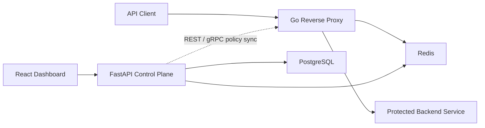

# Aegis

Aegis is an API security platform with a FastAPI Control Plane, Go Reverse
Proxy, and React management dashboard.

## Architecture



- `aegis-backend/`: stores and manages users, API keys, route permissions,
  JWT configuration, rate limits, threat rules, IP blocks, and analytics.
- `reverse-proxy/`: validates API keys and JWTs, enforces security policy and
  Redis-backed rate limits, strips credentials, and forwards allowed traffic.
- `aegis-frontend/`: role-aware management dashboard.

## Run

Requirements: Docker, Python 3, Node.js, Go, `curl`, and `openssl`.

```bash
cd /Users/htunkhainglynn/Projects/aegis
make run
```

The command installs missing dependencies, starts PostgreSQL and Redis, applies
migrations, seeds development data, and launches the system. Use the URLs
printed by `make run`; the core defaults are:

```text
Dashboard:      http://localhost:3000/login
Control Plane:  http://localhost:8000/docs
Reverse Proxy:  http://localhost:8080
```

If a port is occupied, change it in the git-ignored `.env` file and rerun the
command. For example: `PROXY_PORT=8082`.

Keep the terminal open. Press `Ctrl-C` to stop application processes, then stop
PostgreSQL and Redis while preserving their data:

```bash
make stop
```
