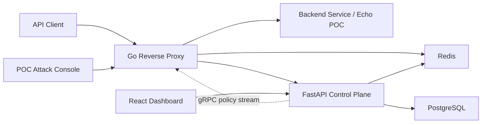

# Aegis

Aegis is a centralized API security and management system. It combines a
FastAPI Control Plane, a Go Reverse Proxy data plane, and a React operator
dashboard to manage and enforce API access policies before requests reach a
backend service.

The project is organized as a monorepo:

| Folder | Purpose |
|---|---|
| `aegis-backend/` | FastAPI Control Plane for users, API keys, rate limits, JWT configs, threat rules, IP blocks, and analytics |
| `reverse-proxy/` | Go Reverse Proxy that validates requests and enforces policy before forwarding |
| `aegis-frontend/` | React dashboard for Admin, Viewer, and API Consumer workflows |
| `docs/` | Requirements, domain model, and API reference |
| `scripts/` | Local/dev automation, seed data, and E2E test scripts |
| `poc/` | Throwaway proof-of-concept echo service and attack/defense console |

## System Architecture



The Control Plane is the source of truth for policy. It stores users, API key
metadata, JWT verification configuration, rate-limit rules, threat rules,
manual/automatic IP blocks, and sanitized security events.

The Reverse Proxy is the enforcement point. For each incoming API request it:

1. Checks IP blocks.
2. Detects configured threat patterns.
3. Requires a valid `X-API-Key`.
4. Requires a valid `Authorization: Bearer <jwt>` token.
5. Applies Redis-backed distributed rate limiting.
6. Strips credentials before forwarding to the backend service.
7. Reports sanitized security events back to the Control Plane.

The dashboard talks only to the Control Plane. It is a management UI, not an
enforcement layer; backend authorization still protects every sensitive route.

## Requirements

Install these first:

- Docker Desktop or Docker Engine with Compose
- Python 3
- Node.js 22.13 or newer
- Go
- `openssl`
- `curl`

## Quick Start: Run Everything Locally

From the monorepo root:

```sh
cd /Users/htunkhainglynn/Projects/aegis
make run
```

`make run` starts the full local development stack:

- PostgreSQL and Redis through Docker Compose
- FastAPI Control Plane on `http://localhost:8000`
- Go Reverse Proxy on `http://localhost:8080`
- React dashboard on `http://localhost:3000`
- POC echo backend on `http://localhost:9000`
- POC attack console on `http://127.0.0.1:9100`

Keep the terminal open while using the project. Press `Ctrl-C` to stop the
foreground app processes, then run this to stop Postgres and Redis:

```sh
make stop
```

## First-Time Setup, Step by Step

Use these commands if you want to run the setup manually instead of using the
single command above.

1. Generate local secrets:

```sh
make init
```

This creates a git-ignored `.env` file with local passwords, JWT secrets, and
an initial Admin account.

2. Start infrastructure:

```sh
make services
```

3. Install missing dependencies, apply database migrations, and seed demo data:

```sh
make prepare
```

The seed script prints dev-only API keys and a short-lived demo JWT. These raw
values are printed once for manual testing and are not committed.

4. Run all local projects:

```sh
make run
```

## Login

Show the generated Admin credentials:

```sh
make credentials
```

Open the dashboard:

```text
http://localhost:3000/login
```

Seeded development users are also created for manual RBAC testing:

- `viewer@aegis.local`
- `consumer1@aegis.local`
- `consumer2@aegis.local`

The seed script uses a loud dev-only fallback password unless you override it
with environment variables. Never reuse seeded credentials outside local
development.

## POC Attack/Defense Demo

Run the stack:

```sh
make run
```

Open:

```text
http://127.0.0.1:9100
```

Paste the seed output exports into the console. The console can test:

- valid API key + JWT request succeeds
- revoked API key is rejected
- missing API key is rejected
- malformed API key is rejected
- rapid requests trigger rate limiting
- consumer2 is not rate limited by consumer1's per-key rule

The target backend for the demo is the echo service at `/api/echo`, which
returns request headers and a timestamp so you can prove the request reached
the backend only when the proxy allowed it.

## Docker Compose Production-Like Stack

To run the containerized stack instead of the local dev runner:

```sh
make init
make up
```

Useful URLs:

```text
Dashboard:     http://localhost:3000/login
Control Plane: http://localhost:8000/docs
Reverse Proxy: http://localhost:8080
```

Stop containers but keep data:

```sh
make stop
```

Stop containers and remove local data volumes:

```sh
make clean
```

## Testing

Run the complete project checks:

```sh
make check
```

This runs:

- Control Plane pytest suite and coverage report
- Reverse Proxy Go race tests, vet, formatting check, and coverage gate
- Frontend lint and rendered HTML tests
- Dev tooling and POC tests

Run the isolated real-process E2E test:

```sh
make e2e
```

The E2E script uses disposable ports, credentials, and Docker volumes so it
does not depend on your normal local stack.

## Useful Commands

| Command | Description |
|---|---|
| `make help` | Show available commands |
| `make run` | Run every local project in one foreground session |
| `make dev` | Alias for `make run` |
| `make prepare` | Install missing deps, start infra, migrate, and seed dev data |
| `make credentials` | Print local Admin login |
| `make services` | Start only Postgres and Redis |
| `make stop` | Stop Docker services and preserve data |
| `make clean` | Stop Docker services and remove data volumes |
| `make reset-dev` | Reset local Postgres/Redis volumes and regenerate `.env` |
| `make check` | Run all checks |
| `make e2e` | Run full isolated E2E verification |

## Troubleshooting

If `make run` says the local Postgres database rejects the `.env` credentials,
your Docker volume is stale. Reset the local dev volumes:

```sh
make reset-dev
make run
```

Use `make reset-dev` only for local development data. It removes the local
Postgres and Redis volumes.

If a port is already in use, edit the port values in `.env`:

```text
CONTROL_PLANE_PORT=8000
PROXY_PORT=8080
DASHBOARD_PORT=3000
UPSTREAM_PORT=9000
```

Then rerun:

```sh
make run
```

## Security Notes

- Never commit `.env`.
- Raw API keys are shown once at creation or seed time only.
- API key hashes are never rendered or exposed.
- JWT signing keys are encrypted at rest and masked in operator-facing APIs.
- The proxy removes `X-API-Key` and `Authorization` before forwarding requests.
- The attack console and echo service are local POC tooling only; they are not
  production components.

Project scope and contracts live in [`docs/`](docs/). Verified build status
and engineering decisions are tracked in [`AGENTS.md`](AGENTS.md).
